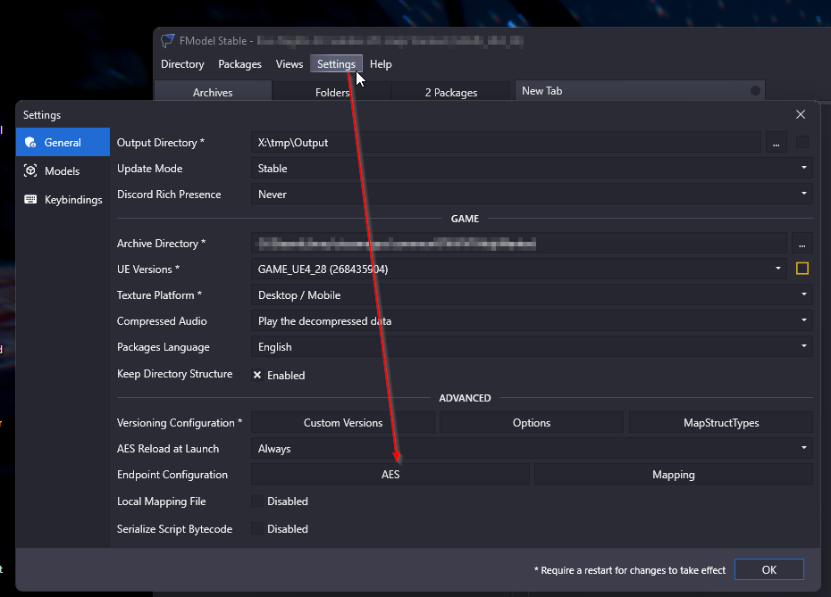
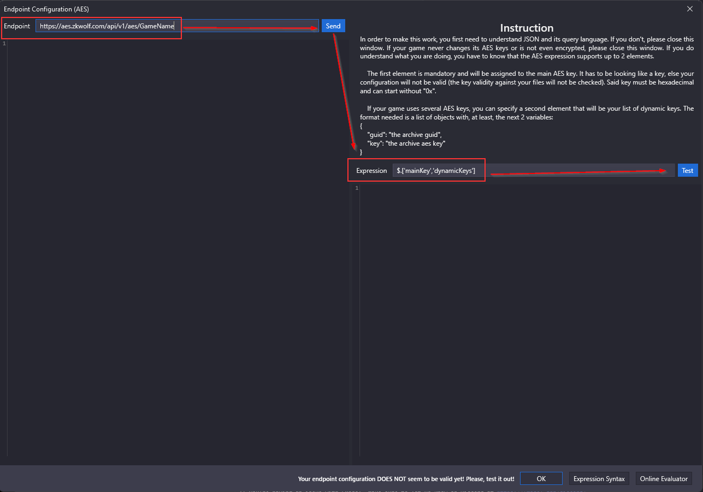
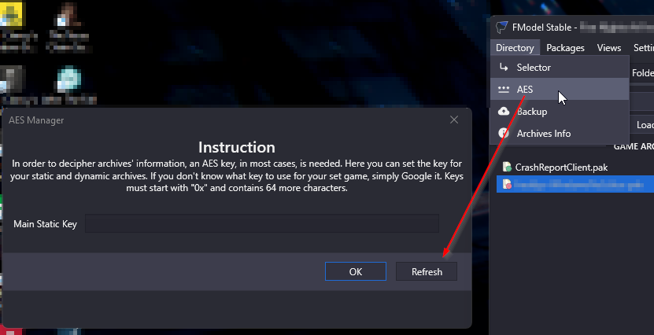
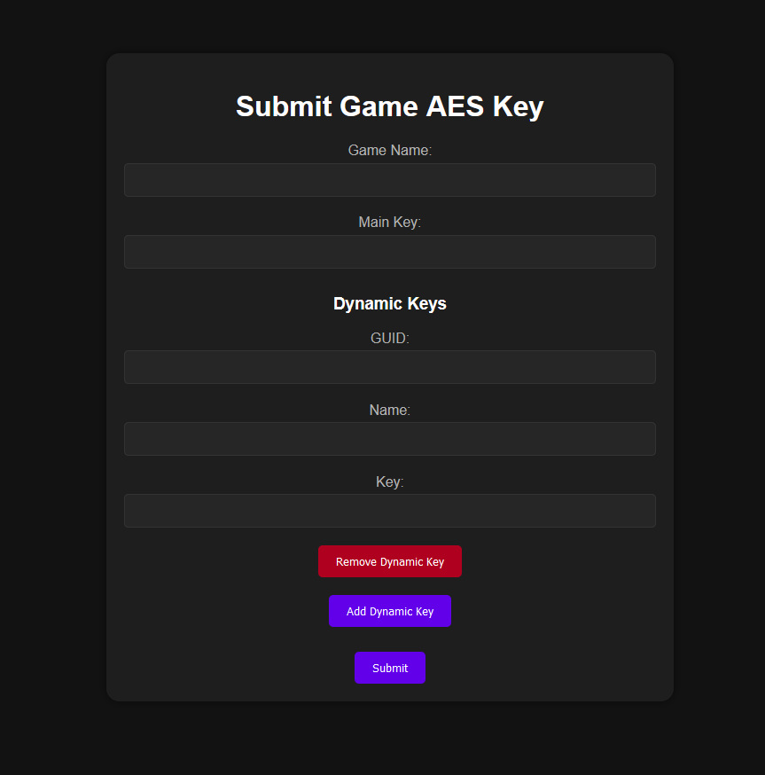

# AES_API
API for hosting Unreal Engine PAK Encryption keys.

This tool was made with FModel in mind. Please read the guide below to use it.

The API is hosted at: https://aes.zkwolf.com/

## Usage with FModel

If you are using FModel you can use the API to get the keys for the game you are trying to decrypt.

1. Get your game from the API: https://aes.zkwolf.com/api/v1/aes/GAME_NAME (remove /GAME_NAME to get a list of all games)
2. Copy that URL and in FModel go to "Settings" -> "Endpoint Configuration" -> "AES" 

3. Paste the URL in the "AES" field and also enter `$.['mainKey','dynamicKeys']` under Expression 

4. After you have done that go back and click "Directory" -> "AES" and click Refresh 

5. Click OK and have fun!

## Using the API

### Get a list of all games
The Game list is hosted under https://aes.zkwolf.com/api/v1/aes/

### Register a User.
If you want to add a new game you need to register a user.
* go to https://aes.zkwolf.com/profile and register a user.
* Copy your "token"
* You can either post a new game with the API in json or via the HTML page below!

### POST a new game
Games are hosted under https://aes.zkwolf.com/api/v1/aes/

You can register a account under https://aes.zkwolf.com/profile.

After that you can use the "Go to AES Page" button to add a new game via the form.

### GET a game
To get a games key you can either use FModel as described above or use the API directly.

## TODO
* Add a way to update games (include HTML)
* Add a way to delete games (include HTML)
