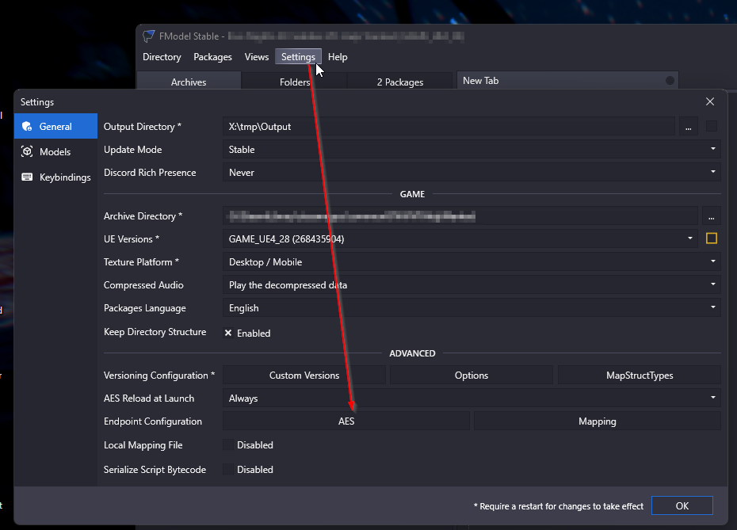
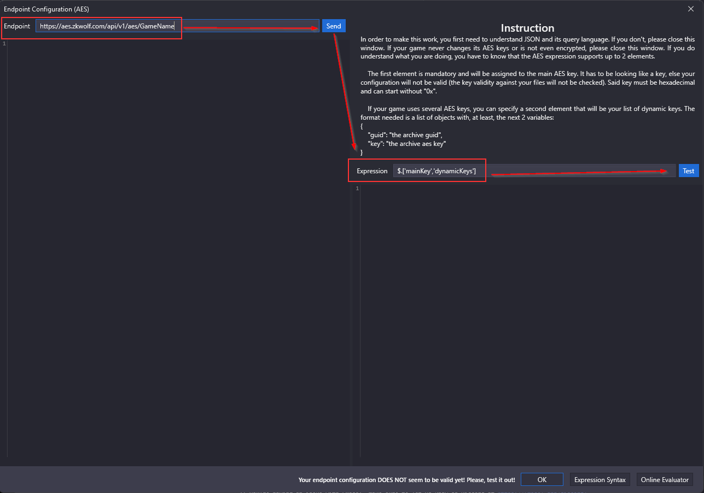
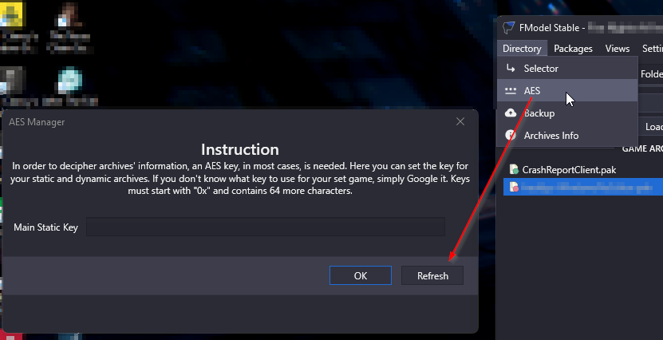

# AES_API
API for hosting Unreal Engine PAK Encryption keys.

This tool was made with FModel in mind but the FModel integration is not finished yet.

The API is hosted at: https://aes.zkwolf.com/

## Usage with FModel

If you are using FModel you can use the API to get the keys for the game you are trying to decrypt.

1. Get your game from the API: https://aes.zkwolf.com/api/v1/aes/GAME_NAME (remove /GAME_NAME to get a list of all games)
2. Copy that URL and in FModel go to "Settings" -> "Endpoint Configuration" -> "AES" 


3. Paste the URL in the "AES" field and also enter `$.['mainKey','dynamicKeys']` under Expression 


4. After you have done that go back and click "Directory" -> "AES" and click Refresh 


5. Click OK and have fun!

## Using the API

### Get a list of all games
The Game list is hosted under https://aes.zkwolf.com/api/v1/aes/

### Register a User.
If you want to add a new game you need to register a user.
* go to https://aes.zkwolf.com/profile and register a user.
* Copy your "token"
* With a tool like Postman or insomnia POST a new game!

### POST a new game
Games are hosted under https://aes.zkwolf.com/api/v1/aes/

To add a new game POST a request to that URL with the GameName after the slash.

```
POST https://aes.zkwolf.com/api/v1/aes/HYENAS
{
   "dynamicKeys":[],
   "mainKey":"0x35BA3129A49E9E0372E3401BB50A6A808E6C5B60DCC2D339C390B4C0C494BD43",
   "unloaded":[],
   "version":"0"
}
```

If your game has multiple keys you can add them to the dynamicKeys array.

```
POST https://aes.zkwolf.com/api/v1/aes/HYENAS
{
   "dynamicKeys":[
      {
         "guid":"00000000-00000000-00000000-00000000",
         "key":"0x35BA3129A49E9E0372E3401BB50A6A808E6C5B60DCC2D339C390B4C0C494BD43",
         "name":"pakchunk0-WindowsClient.pak"
      }
   ],
   "mainKey":"0x35BA3129A49E9E0372E3401BB50A6A808E6C5B60DCC2D339C390B4C0C494BD43",
   "unloaded":[
      
   ],
   "version":"0.1"
}
```

### GET a game
To get a game you can use the same URL but with GET and no body.

```
GET https://aes.zkwolf.com/api/v1/aes/HYENAS
```

## TODO
* Add a way to update games (include HTML)
* Add a way to delete games (include HTML)
* Add a HTML page to add games
* Make the HTML look better (a lot...)